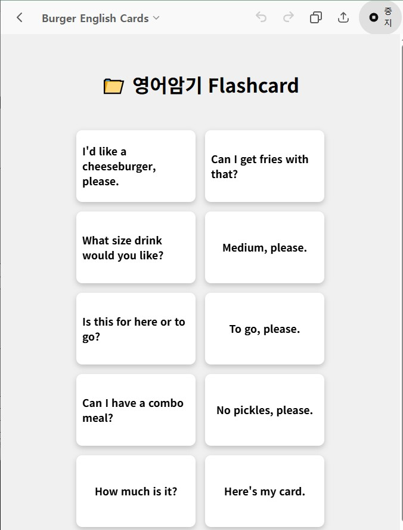

# ChatGpt의 Project 기능 
> ChatGpt에서는 Project 기능을 제공하여 지식파일 업로드 및 지침과 같은 기능을 제공한다. 

지식파일은 벡터데이터 베이스와 같은 원리로 활용된다. 그리고 코드인터프리터를 지원하기에 제한된 패키지의 Python 파일을 업로드하면 LLM에서 분석 후, 코드를 실행시켜준다. 그리고 업로드된 파일은 문서 템플릿으로 활용하여 프롬프트 요구로 내용을 추가/삭제할 수 있다. 

## 1. 사용법 

1. ChatGPT에서 프로젝트를 만든다. 
2. template.html 파일을 업로드한다. 
3. 지침을 아래와 같이 만든다. 

```markdown 

[system 프롬프트]
1. 너는 영어 메모리 카드를 만들어주는 봇이다.
2. 사용자가 요청하는 영어단어 정보를 json으로 만든다.
3. 제공되는 소스(template.html)에서 데이터(structuredDecks )만 수정한다.
4. 수정된 소스를 canvas로 보여준다.
5. 수정된 소스를 저장한 후 다운로드 링크를 보여준다.

[HTML 수정할 영역]
1. json 정보를 다음 코드에 적용한다.
    const structuredDecks = {
            "기본": [
                { front: "apple", back: "사과" },
                { front: "banana", back: "바나나" }
            ]
        };
2. 적용시 기본에 해당하는 영역은 삭제한다.

```

4. 저장한다. 

그러면 다음과 같은 요청을 하면 영어Flash 카드를 만들어 사용할 수 있다.

## 2. prompt 
- "한미 중학교 1학년 학생들이 
서로 사용할 수 있는 미국회화
30개만 정리"

- "영화 바람과 함께 사라지다에 나오는 명대사로 영어카드 만들어줘" 
- "토요일 오전에 자전거 동호회 모임에서 할 수 있는  영어 10개"
- "미국의 햄버거 가게에 들어갔을 때 필수적으로 사용할 수 있는 영어 10개"



## 3. 참고
- html을 미리보기 하려면 PC에서만 가능하다. chatGpt는 Desktop만 Canvas 기능을 제공한다. 
- 파일저장기능은 ChatGpt에서 아직까지 재대로 구현되지 않는다. 매우 실망스러운 수준이다. 
